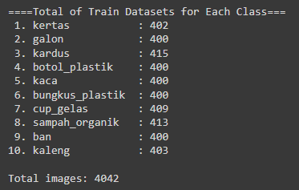
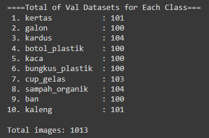
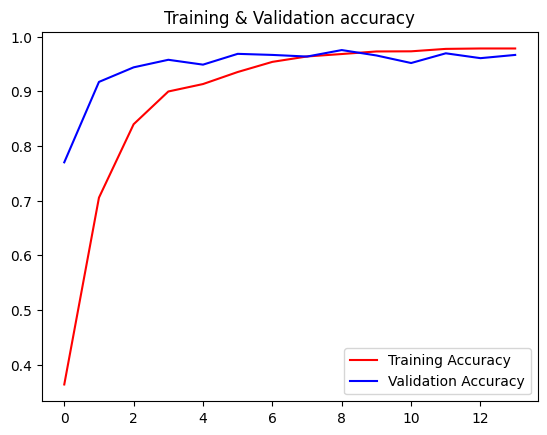
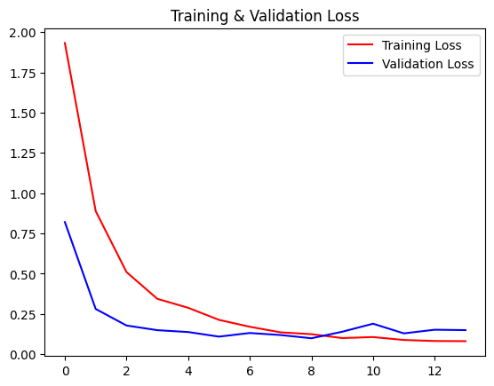
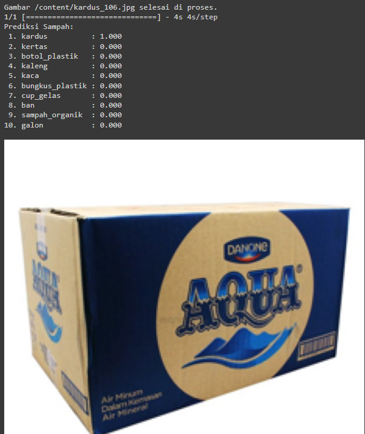
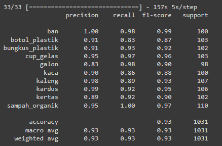
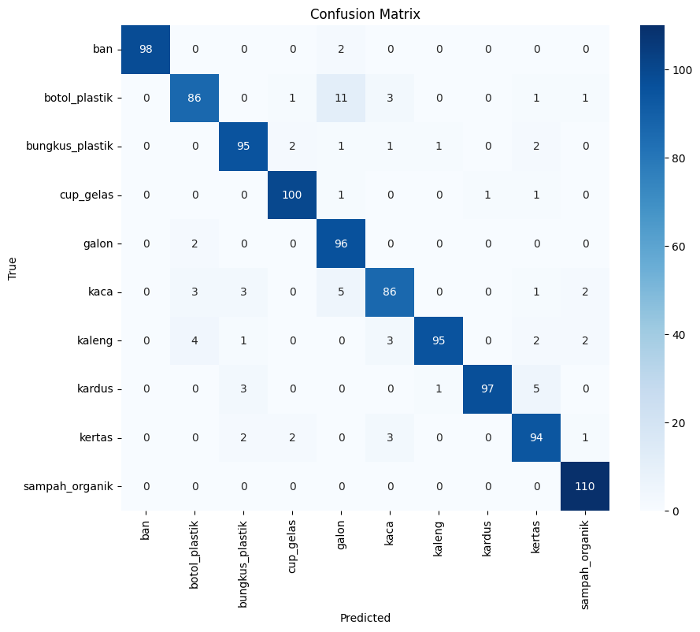
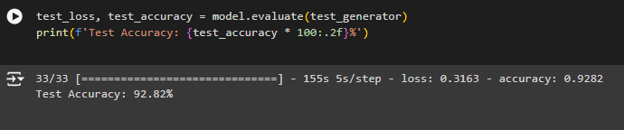
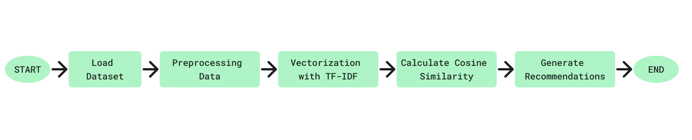

# 🪴🗑 REBIN MACHINE LEARNING PROJECT

## About the Project

### Machine Learning Team Members:
1. M124D4KX1516 – Kartika Deviani – Politeknik Harapan Bersama
2. M232D4KY2952 – Patrick Ulysses – Universitas Katolik Parahyangan
3. M232D4KX2774 – Sherrine Tania – Universitas Katolik Parahyangan

### ReBin Project Background
The issue of waste in Indonesia has become increasingly complex, with communities generating 17.6 million tons of waste annually, of which only 67.4% is effectively managed. This leaves 32.6% of waste unmanaged due to low awareness of waste management practices, resulting in environmental pollution, health issues, and economic losses. A significant challenge is the identification and proper management of various waste types, worsened by inadequate education on disposal and recycling. Our goal is to address these challenges with an innovative solution: an application that accurately identifies waste types, educates on recycling processes, and promotes sustainable waste management practices nationwide.

### Machine Learning Part in the Project
Build waste classification models using TensorFlow with DenseNet121 for 10 types of waste, and create a content-based recommendation system using TF-IDF and cosine similarity.

## Image Classification Model

### Tools & Libraries:
- Google Colab
- TensorFlow
- Matplotlib
- NumPy
- Scikit-learn
- PIL

### Dataset:
[Dataset Link](https://drive.google.com/drive/folders/1R5KiMunBInm5kznj8nmTd9YJwDePGQrp?usp=sharing)

### Splitting Dataset
[Splitting Code](splitting.ipynb)
- Train: 80% <br>
  
- Validation: 20% <br>
  

### Building Model
We use Transfer Learning Model DenseNet121. <br>
[Modeling Code](WasteClassification_DenseNet121.ipynb)

### Training Result
The model achieved 96% validation accuracy and 0.14 validation loss. <br>
 

### Prediction Test


### Testing Result
We tested the H5 Model using a dataset of 1031 images.
- Classification Report <br>
  
- Confusion Matrix <br>
  
- Testing Accuracy: The model achieved 92% testing accuracy. <br>
  

## Recommendation System Model

### Tools & Libraries:
- Google Colab
- Visual Studio Code
- Pandas
- re
- Scikit-learn (TfidfVectorizer and cosine_similarity)

### Dataset:
- [Dataset Link](https://github.com/ReBin-Recyle-Your-Bin/ReBin-MachineLearning-ModelandAPI/blob/master/dataset_recommendation.xlsx)

### Workflow

#### Content-Based Filtering [Recycle Recommendation Model](recycleRecommendation.py) 


1. **Load Dataset:**
   First, load the dataset (`dataset_recommendation.xlsx`) using the `load_dataset()` function from the pandas library. This function reads the Excel file and stores it in a pandas DataFrame.

2. **Preprocessing Data:**
   The `preprocessing_data()` function is used to clean and preprocess text data from the dataset by converting text to lowercase, removing numbers, non-alphanumeric characters, underscores, and extra whitespaces.

3. **Vectorization with TF-IDF:**
   The `get_recommendation(keyword)` function utilizes TF-IDF vectorization to convert text data into numerical vectors:
   - Combines relevant text columns (`ingredients` and `name`) into a single string (`combined_text`) for each entry in the dataset.
   - Initializes a `TfidfVectorizer` object to apply the preprocessing function and transform `combined_text` into a TF-IDF matrix (`recycling_matrix`).

4. **Calculating Cosine Similarity:**
   Calculates the cosine similarity between the TF-IDF vector of the `keyword` input and the TF-IDF matrix of the dataset using `cosine_similarity()`.

5. **Generating Recommendations:**
   - Sorts the cosine similarity scores to find the most relevant recommendations.
   - Retrieves the top 3 recommendations (`top_3_recycling`) based on highest similarity scores.
   - Formats recommendations into a list of dictionaries (`recycling_cleaned`) with details like name, ingredients, and cosine similarity.

## API Machine Learning for Deployment

We use the Flask framework to build an API for image classification and recycling recommendation system.

### Endpoints
- POST /ID/predict : Submit a request to make a prediction using a machine learning model (Output: Indonesian).
- POST /EN/predict : Submit a request to make a prediction using a machine learning model (Output: English).


### How to Use

#### In Local Deployment:

1. **Clone the Repository:**
   ```bash
   git clone https://github.com/ReBin-Recyle-Your-Bin/ReBin-MachineLearning-ModelandAPI.git
   cd ReBin-MachineLearning-ModelandAPI

2. Set Up Environment:
   - Create a virtual environment (optional but recommended):
     ```bash
     python -m venv env

    - Activate the virtual environment:
         - On Windows:
           ```bash
           .\env\Scripts\activate
         - macOS and Linux:
           ```bash
           source env/bin/activate
  3. Install Dependencies:
       ```bash
        pip install -r requirements.txt
  4. Run the Flask Application
       ```bash
       python main.py

