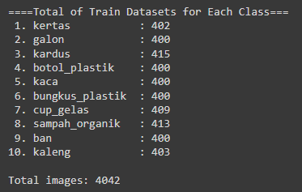
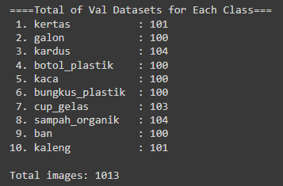
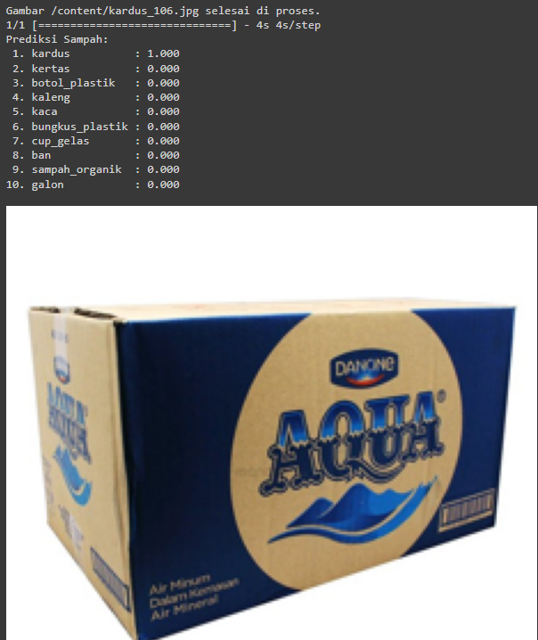
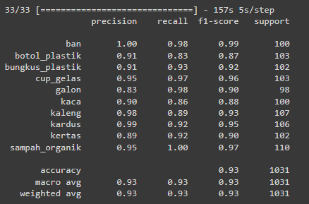
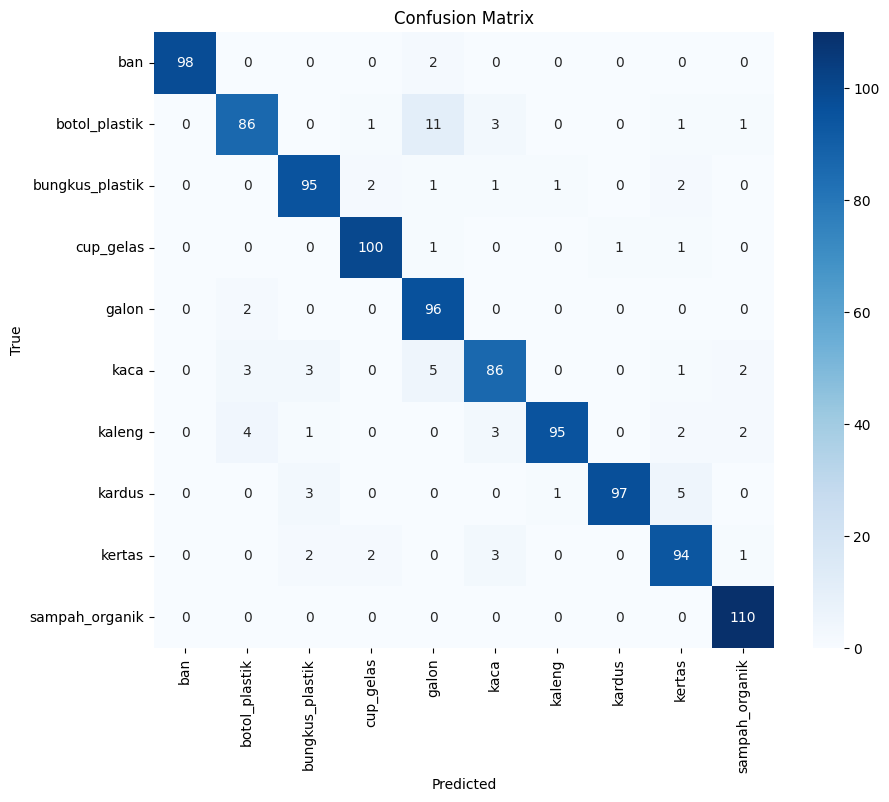
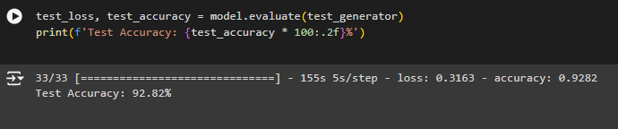

# REBIN MACHINE LEARNING PROJECT
## About Project
### Machine Learning Team Members
1. M124D4KX1516 – Kartika Deviani – Politeknik Harapan Bersama
2. M232D4KY2952 – Patrick Ulysses – Universitas Katolik Parahyangan
3. M232D4KX2774 – Sherrine Tania – Universitas Katolik Parahyangan
### ReBin Project Background
The issue of waste in Indonesia has become increasingly complex, with communities generating 17.6 million tons of waste annually, of which only 67.4% is effectively managed. This leaves 32.6% of waste unmanaged due to low awareness of waste management practices, resulting in environmental pollution, health issues, and economic losses. A significant challenge is the identification and proper management of various waste types, worsened by inadequate education on disposal and recycling. Our goal is to address these challenges with an innovative solution: an application that accurately identifies waste types, educates on recycling processes, and promotes sustainable waste management practices nationwide.
### Machine Learning Part in Project
Prepare the necessary datasets for image classification and a recommendation system. 
Build Waste classification models using TensorFlow with DenseNet121 with 10 type of waste, 
and create a content-based recommendation system using TF-IDF and cosine similarity.

## Image Classification Model
### Tools & Library
- Google Colab
- Tensorflow
- Mathplotlib
- Numpy
- Sklearn
- PIL

### Dataset
[Dataset](https://drive.google.com/drive/folders/1R5KiMunBInm5kznj8nmTd9YJwDePGQrp?usp=sharing)
### Splitting Dataset
[Splitting Code]([splitting.ipynb])
- Train : 80%
  
- Validation : 20%
  
### Building Model
We use Transfer Learning Model DenseNet121  
[Modeling Code]([WasteClassification_DenseNet121.ipynb])
### Training Result
Model reach 96% validation accuracy and 0.14 validation loss  
 
### Prediction Test

### Testing Result
We test H5 Model using dataset testing with 1031 images. 
- Classification Report
  
- Confusion Matrix
  
- Testing Accuracy
  Model reach 92% Testing accuracy  
  
  

## Recomendation System Model
### Tools & Library
- Google Colab
- Visual Studio Code
- Pandas
- re
- Sklearn (TfidfVectorizer and cosine_similarity)
### Dataset
- [Dataset](https://github.com/ReBin-Recyle-Your-Bin/ReBin-MachineLearning-ModelandAPI/blob/master/dataset_recommendation.xlsx)
### Workflow
#### Content-Based Filtering Recycle Recomendation Model ([recycleRecomendation.py]) 

1. Load Dataset
   First, you need to load the dataset (dataset_recommendation.xlsx) using the load_dataset() function from the pandas library. This function reads the Excel file and stores it in a pandas DataFrame.
2. Preprocessing Data
   The preprocessing_data() function is used to clean and preprocess text data from the dataset. It performs the following steps:
   - Converts text to lowercase.
   - Removes numbers.
   - Removes non-alphanumeric characters and underscores.
   - Removes extra whitespaces.
3. Vectorization with TF-IDF
   The get_recommendation(keyword) function utilizes TF-IDF (Term Frequency-Inverse Document Frequency) vectorization to convert text data into numerical vectors. Here's how it works:
   - Combines relevant text columns (ingredients and name) into a single string (combined_text) for each entry in the dataset.
   - Initializes a TfidfVectorizer object from sklearn.feature_extraction.text module, which applies the preprocessing_data() function to clean the text.
   - Fits and transforms the combined_text data into a TF-IDF matrix (recycling_matrix), representing the importance of each word or phrase in each document relative to the entire dataset.
4. Calculating Cosine Similarity
   After vectorizing the dataset and the user's input (keyword):
   - Converts the keyword into a TF-IDF vector (keyword_vector).
   - Calculates the cosine similarity between keyword_vector and recycling_matrix using cosine_similarity() from sklearn.metrics.pairwise module.
   - Cosine similarity measures the similarity between two vectors of TF-IDF values, indicating how similar the keyword is to each entry in the dataset.
5. Generating Recommendations
   - Sorts the similarity scores in descending order to find the most relevant recommendations.
   - Retrieves the top 3 recommendations (top_3_recycling) based on the highest cosine similarity scores.
   - Formats the recommendations into a list of dictionaries (recycling_cleaned), including details like name, ingredients, and cosine_similarity.
  
  ## API Machine Learning for Deployment 
  
   

